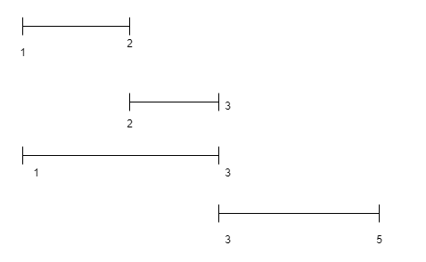

# Бодлого 5 интервал 

### Naive solution 

N интервалуудын бүх боломжит олонлогийг үүсгэн тэдгээрээс хамгийн их жинтэй олонлогийг аван хариуг гарган авах боломжтой. Гэвч ингэснээр бодолтын time complexity O(2^n) болно. 

### Лекцэн дээр дурдагдсан санаа 

Интервалуудыг pair<pair<int,int>, int> a[n] гэсэн хүснэгтэд хадгалан int dp[n] хүснэгтэд динамик програмчлалын дэд бодлогын утгуудыг хадгалая. Энд ```pair<T,T>``` нь заасан 2 төрлийн өгөгдөл хадгалах өгөгдлийн бүтэц юм. 

dp[i]-аар эхний i интервалаас авч болох хамгийн их жинг хадгалая. Тэгвэл dp[0], dp[1], ... dp[i-1] дэд бодлогуудыг бодсон тохиолдолд dp[i]-г хэрхэн тодорхойлох вэ?  

Интервалууд огтлолцохгүй байх ёстой тул a[i] интервалыг нэмэхийн тулд dp[i-1] жинг бүтээх интервалуудаас a[i]-тэй огтлолцох интервалуудыг олох шаардлагатай ба тэдгээрийг хасна. Иймд хайлтын хугацаа дор хаяж O(n) болох бөгөөд огтлолцох интервалуудыг хассаны дараагаар a[0], .... a[i-1] интервалуудаас dp[i] жинг үүсгэхэд ашиглаж болох интервалууд нэмэгдэж болно. Гэх мэтчилэн dp[i]-г тодорхойлоход бусад дэд бодлогуудыг хангалттай сайн ашиглаж чадахгүй болох тул тохиромжтой шийдэл биш юм. 

### Үндсэн бодолт 

Дээрх санаанд гарах хүндрэлийг шийдэх арга нь интервалуудыг төгсгөлийн цэгээр нь эрэмбэлэх юм. Төгсгөлийн цэгээр эрэмбэлсэн үед dp[i]-г хэрхэн тодорхойлох тухай авч үзье. 
``` 
a[0], a[1], ...., a[k], .... a[i-1], a[i] 
``` 
i-р элемент хүртэлх элэментүүдийн хувьд дараах нөхцөл биелэх k индекстэй элементийг авч үзье. 

``` 
a[k].first.second < a[i].first.first && a[k+1].first.second >= a[i].first.first 

k нь төгсгөл нь a[i]-ийн эхлэлээс бага байх эхлэл нь хамгийн их байх элементийн индекс болно.  
``` 

Тэгвэл dp[k] дэд бодлогын утга дээр a[i]-ийн жинг нэмэхэд dp[i] дэд бодлогын утга гарна. Учир нь dp[k]-т авсан интервалууд дээр a[i] интервалыг нэмэхэд огтлолцохгүй байх нь илэрхий. Учир нь a[0], a[1], ... a[k] интервалуудын төгсгөл нь a[i]-ийн эхлэлээс бага байна. Дараах жишээнд 4 дэх интервалын хувьд эхний интервал нь бидний хайж буй интервал болно. Харин 1-3 дахь интервалын хувьд харгалзах k интервал олдохгүй. Энэ тохиолдолд dp[i] нь тухайн интервалын жин болон dp[i-1]-ийн аль их утгаар тодорхойлогдоно. 



Дээрхээс бид дэд бодлогуудын хамаарлыг дараах байдлаар тодорхойлж болно. 
``` 
if (a[l].second < st) {
    dp[i] = max(dp[i-1], dp[l] + a[i].second) ; 
} else {
    dp[i] = max(dp[i-1], a[i].second) ; 
}
```  

Ийнхүү бодолт хийхэд бодлогын time complexity нь O(n^2) болно. Интервалуудыг төгсгөлөөр нь эрэмбэлсэн тул k индексийг хоёртын хайлт ашиглан O(logn) хугацаанд олж болохыг дараах хэсэгт харуулав. 

```
int l = 0, r = i - 1 ; 
while (l < r) {
    int m = (l + r + 1) / 2 ;
    if (a[m].first.second < st) {
        l = m ; 
    } else {
        r = m - 1 ; 
    }
}
``` 
## Бодолт 

Дараах хэсэгт үндсэн бодолтыг харуулав. Энд pair<T,T> өгөгдлийн бүтцийн эхний элементэд .first, дараагийн элементэд .second гэж хандана. 

Интервалуудыг хадгалах хүснэгтийг нэмэлт cmp функц тодорхойлон sort() функцэд дамжуулан ашиглаж эрэмбэлсэн байгааг анхаарна уу. 

```
#include<bits/stdc++.h>
using namespace std ;
#define pii pair<int,int>
#define dbg(x) cout << #x << ": " << x << " " ; 
#define ell cout << "\n" ; 

bool cmp (pair<pii, int> p1, pair<pii, int> p2) {
    return p1.first.second < p2.first.second ; 
}

int main () {
    int n ; cin >> n ; 
    pair<pair<int,int>, int> a[n] ; 
    int dp[n] ;
    memset(dp, 0, sizeof dp) ; 
    for (int i = 0 ; i < n ; i ++) {    
        cin >> a[i].first.first >> a[i].first.second >> a[i].second ; 
    }

    sort(a, a+n, cmp) ;
    
    dp[0] = a[0].second ; 
    for (int i = 1 ; i < n ; i ++) { 
        int st = a[i].first.first ; 
        // l ba r ni haih range-iin zuun ba baruun hyzgaar 
        int l = 0, r = i - 1 ; 
        while (l < r) {
            int m = (l + r + 1) / 2 ;
            if (a[m].first.second < st) {
                l = m ; 
            } else {
                r = m - 1 ; 
            }
        }

        if (a[l].second < st) {
            dp[i] = max(dp[i-1], dp[l] + a[i].second) ; 
        } else {
            dp[i] = max(dp[i-1], a[i].second) ; 
        }
    }
    cout << dp[n-1] << "\n" ; 
}
``` 
Тайлбарласан: Нямдаваа